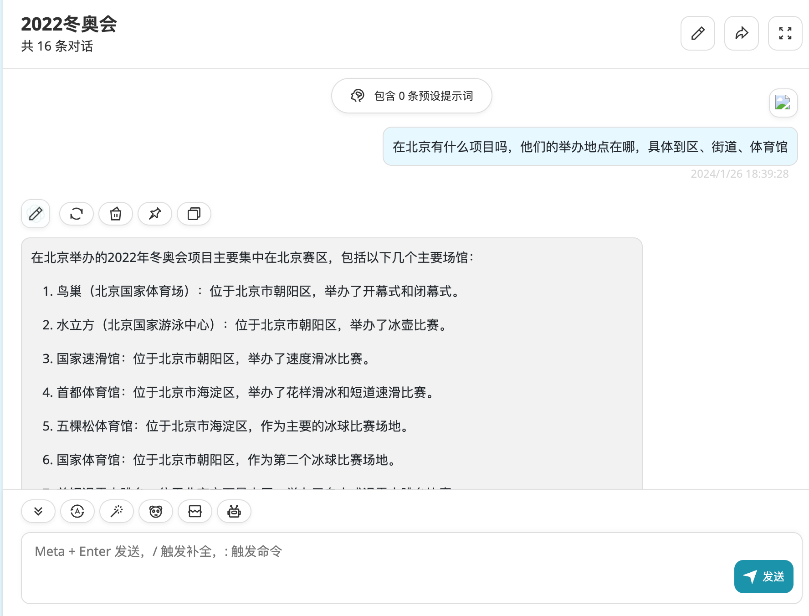

# gpt_helper
尝试给gpt添加参考信息

主要针对gpt记忆库以外的信息

## 参考信息

参考openai的[Embedding Wikipedia articles for search](
https://github.com/openai/openai-cookbook/blob/2c441ab9a200070fee204a63b4203628c456e878/examples/Embedding_Wikipedia_articles_for_search.ipynb#L647
)

参考openai的[Question answering using embeddings](
https://github.com/openai/openai-cookbook/blob/d891437737cf990a84fc7ac8516d615d7b65540b/examples/Question_answering_using_embeddings.ipynb#L609
)

## 主要工作
1、基础逻辑：数据收集

2、文本嵌入：然后，我们使用OpenAI的text-embedding-ada-002模型，将每个段落或小节的文本转换成一个嵌入向量，并将这些向量保存到一个CSV文件中。

3、数据加载：在需要回答问题时，我们从CSV文件中加载数据，包括每个段落或小节的文本和对应的嵌入向量。

4、问题解答：对于给定的问题，我们首先使用同样的嵌入模型将问题转换成一个嵌入向量。然后，我们在所有段落或小节的嵌入向量中找到与问题嵌入向量最相似的向量，将对应的段落或小节作为相关信息。最后，我们使用OpenAI的GPT模型，以问题和相关信息作为输入，生成问题的答案。

5、将上述部分整合成一个本地的标准api代理，方便第三方gpt client调用

## TODO
将此功能封装成gpt插件

或者将此功能做的更加灵活，内容可以随时添加或更新

## 初步结果

将wiki中2022冬奥会的内容，转换成嵌入向量，然后使用gpt生成问题答案
对他进行提问，感觉效果还不错

## TODO2
更好的读取代码

希望可以实现，将一个代码项目整个读取进来，然后就可以对这个项目进行提问
由于提问的方式有很多，所以可能需要不同的方式进行关联。

目前想到的提问方式：

1、代码理解，类似知识点问询，比如：这个函数是干什么的？这个变量是干什么的？这个类是干什么的？

2、代码静态分析，比如：这段代码会有什么问题，这段代码的性能如何？

3、代码调用问题，主要是github上的开源代码，引用调用时在本地出了问题，提问时附加自己的调用代码或使用场景+报错信息，然后问如何解决？

4、代码修改，比如：要修改那个文件的哪个部分，原因或者目的，让gpt将指定文件或者函数重写。

4+、整体代码重构，比如：重构需求，原因或者目的，让gpt将整个项目（或其中一部分）重写。

5、代码添加，比如：要添加什么功能，原因或者目的，让gpt 新写一些代码，当然，新写的部分可能需要重新录入才能再后续继续使用。

5+、代码仿写，比如：按照另一段代码的功能或者结构，让gpt新写一段代码。

